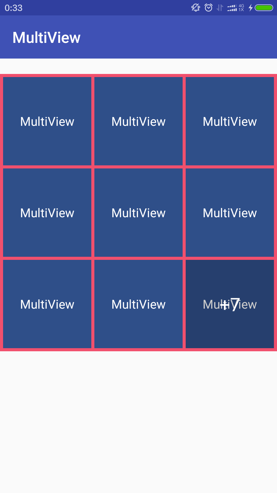

# Android九宫格显示多图或item


## gradle依赖

```
    compile 'cn.lemon:multiview:1.0.1'
```
    
## MultiView

 - 由于依赖了[RestHttp](https://github.com/llxdaxia/RestHttp)加载网络图片，需初始化

```
  RestHttp.initialize(this);
  if(BuildConfig.DEBUG){
       RestHttp.setDebug(true,"network");
  }
```

 - xml布局文件

```xml
    <cn.lemon.multi.MultiView
        android:id="@+id/multi_view"
        android:layout_width="wrap_content"
        android:layout_height="wrap_content"
        android:layout_marginTop="20dp"
        android:background="#f1506d"
        app:divideSpace="8dp"
        app:placeholder="@drawable/holder"/>
```

 设置item之间的间隔`app:divideSpace="8dp"`
 设置占位图`app:placeholder="@drawable/holder"`
 
 - Java代码

```
 multiView = (multiView) findViewById(R.id.cell_view);
 multiView.setLayoutParams(new LinearLayout.LayoutParams(900, ViewGroup.LayoutParams.WRAP_CONTENT));

 data.add("http://i02.pictn.sogoucdn.com/73a90748d5e19769");
 data.add("http://i01.pictn.sogoucdn.com/e19188bbc3966d6f");

 multiView.setImages(data);   设置图片资源
```      

 - 自定义Adapter

 >如果需显示的不是图片，而是复杂的item，需自定义Adapter

 - 继承MultiAdapter

```java
    class MyAdapter extends MultiAdapter<String> {

        private TextView textView;
        public MyAdapter(Context context) {
            super(context);
        }

        @Override
        public View getView(ViewGroup parent, int position) {
            View view = LayoutInflater.from(parent.getContext()).inflate(R.layout.item,parent,false);
            textView = (TextView) view.findViewById(R.id.text);
            return view;
        }

        @Override
        public void setData(String object) {
            super.setData(object);
            textView.setText(object);
        }

        @Override
        public void setOnItemClick() {
            super.setOnItemClick();
            Util.Toast("点击事件");
        }
    }
```

 - 给 MultiView 设置 MultiAdapter，并添加数据

```
   adapter = new MyAdapter(this);
   multiView.setAdapter(adapter);
   adapter.addAll(data);
```

## ViewImageActivity

>显示大图

 - manifests 文件中添加

```xml
   <activity android:name="cn.lemon.multi.ui.ViewImageActivity"/>
```

 - 虽然 ViewImageActivity 主要是联合 MultiView 使用，但是其实不管是否使用 MultiView，
 同样可以使用 ViewImageActivity，只需要在跳转 Activity 的时候绑定好数据，如：

```
  Intent intent = new Intent(itemView.getContext(),ViewImageActivity.class);
  intent.putExtra(ViewImageActivity.IMAGES_DATA_LIST, (Serializable) getData());
  intent.putExtra(ViewImageActivity.IMAGE_NUM, getAdapterPosition());
  itemView.getContext().startActivity(intent);
```

#### 注意事项

依赖的其他库
```
   compile 'com.android.support:appcompat-v7:23.1.1'
   compile 'com.android.support:support-v4:23.1.1'
   compile 'cn.alien95:resthttp:1.0.5'
```

### [详细用法请看Demo](https://github.com/llxdaxia/MultiView/tree/dev/demo)

### 九宫格


### 自定义Adapter

